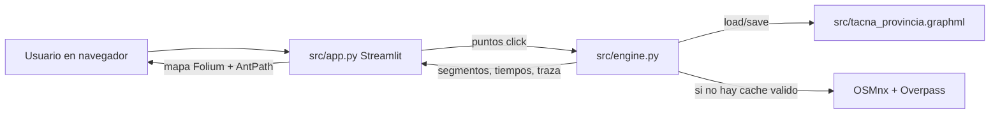

# Contexto tecnico integral - NavExpert Pro

## 1) Objetivo del sistema

NavExpert Pro implementa un solucionador de rutas sobre red vial real para el caso:

- Entrada: un conjunto de puntos geograficos marcados por usuario.
- Restriccion: respetar conectividad y direccion real de calles.
- Optimizacion: minimizar tiempo total de recorrido.
- Salida: orden optimo de visita, geometria de ruta y explicacion de decisiones.

No es un enrutador "por intuicion" ni un LLM. Es un pipeline deterministico de
geometria + grafos + optimizacion combinatoria.

## 2) Arquitectura (frontend + backend)



## 3) Componentes por archivo

1. `src/app.py`
- Orquestador de interfaz.
- Maneja estado de sesion (`st.session_state`).
- Captura eventos del mapa con `st_folium`.
- Llama al motor (`engine.get_graph`, `engine.resolver_tsp_pro`).
- Renderiza ruta y tablas de explicacion.

2. `src/engine.py`
- Backend de datos geoespaciales y optimizacion.
- Carga/reconstruye grafo provincial con OSMnx.
- Inserta nodos virtuales para puntos de usuario.
- Calcula matrices de tiempo/distancia entre puntos.
- Resuelve TSP con OR-Tools.
- Reconstruye segmentos geograficos finales.

3. `src/tacna_provincia.graphml`
- Persistencia del grafo dirigido de calles.
- Evita redescargas en cada arranque.

4. `pyproject.toml`
- Dependencias de runtime y desarrollo.

5. `DATOS.MD/README.md`
- Guia operativa de instalacion/ejecucion.

6. `DATOS.MD/contexto.md`
- Esta especificacion tecnica.

7. `SQL_SUPABASE/*`
- Scripts SQL del repositorio, no acoplados al flujo actual de Streamlit.

## 4) Modelo de datos en runtime

### Estado frontend (`st.session_state`)

1. `puntos: list[tuple[float,float]]`
- Tuplas `(lat, lon)`.
- Indice 0 = origen.

2. `res: tuple | None`
- Forma: `(segmentos, dist_total, tiempos_segmentos, traza)`

3. `mostrar_traza: bool`
- Toggle para renderizar explicacion.

### Grafo backend (`networkx.MultiDiGraph`)

Nodos:
- Coordenadas `x` (lon), `y` (lat).

Aristas:
- `geometry` (LineString)
- `length` (m)
- `speed_kph`
- `travel_time` (s)
- `oneway`

## 5) Flujo exacto de ejecucion

## 5.1 Frontend (`src/app.py`)

Bloque de configuracion:

1. `st.set_page_config(...)` define layout y metadata.
2. Inicializa estado si faltan claves.
3. Carga grafo una sola vez por sesion con `engine.get_graph()`.

Bloque sidebar:

1. Muestra cantidad de puntos activos.
2. Lee checkbox de traza.
3. Al presionar CALCULAR:
- valida minimo 2 puntos
- llama `resolver_tsp_pro(..., con_traza=True)`
- guarda resultado en `st.session_state.res`
4. Al presionar REINICIAR:
- limpia puntos y resultado
- ejecuta `st.rerun()`

Bloque mapa:

1. Centro inicial = primer punto si existe, o centro por defecto.
2. Crea `folium.Map` y agrega `Fullscreen`.
3. Dibuja marcadores:
- verde para origen
- azul para resto
4. Si hay resultado:
- recorre cada segmento
- aplica offset lateral minimo para separacion visual
- dibuja con `AntPath`

Bloque eventos `st_folium`:

1. Si se hace click sobre tooltip de marcador:
- extrae indice
- elimina punto
- limpia resultado
- rerun
2. Si se hace click en mapa:
- agrega nuevo punto si no esta duplicado exacto
- limpia resultado
- rerun

Bloque traza:

1. Si hay resultado y toggle activo:
- muestra ruta final textual
- muestra tablas por paso
- muestra matriz resumen

## 5.2 Backend (`src/engine.py`)

### 5.2.1 Carga/reconstruccion de grafo

Funciones clave:

1. `_graph_looks_too_small(G)`
- evalua numero de nodos y extension del bbox
- umbral actual: `<10000` nodos o ancho/alto `<0.20` grados

2. `_build_province_graph()`
- itera mirrors Overpass definidos en `OVERPASS_URLS`
- prueba distancias en `PROVINCE_DISTANCES` (85km, 65km, 45km)
- usa `ox.graph_from_point(PROVINCE_CENTER, ...)`

3. `get_graph()`
- si existe GraphML y no es pequeno: load + return
- si no: reconstruye
- enriquece aristas con velocidad y tiempo
- reduce a componente fuertemente conexa mayor
- persiste en GraphML

### 5.2.2 Resolucion TSP (`resolver_tsp_pro`)

Paso 1. Validacion minima:
- con menos de 2 puntos retorna vacio.

Paso 2. Copia de trabajo del grafo:
- `G_work = G.copy()` para no mutar cache base.

Paso 3. Proyeccion de cada punto a la red:

1. `ox.nearest_edges` obtiene arista vial mas cercana.
2. Shapely proyecta punto real sobre la geometria de la arista.
3. Crea nodo virtual ID `990000 + i`.
4. Divide la arista original en dos geometrias (`geom_u`, `geom_v`).
5. Reemplaza arista original por nuevas aristas hacia/desde nodo virtual.
6. Respeta direccion:
- si `oneway=True`, no crea inversas
- si no, crea inversas usando `reverse()`

Paso 4. Matrices O-D entre nodos virtuales:

1. `matriz_tiempo[i][j]` con `shortest_path_length(weight='travel_time')`.
2. `matriz_distancia[i][j]` con `shortest_path_length(weight='length')`.
3. Si no hay camino, asigna penalizacion `1e7`.

Paso 5. Modelo OR-Tools:

1. `RoutingIndexManager(n, 1, 0)`:
- `n` nodos
- `1` vehiculo
- depot inicial = 0
2. `RoutingModel(manager)`.
3. Callback de costo entero basado en `matriz_tiempo`.
4. `SetArcCostEvaluatorOfAllVehicles`.
5. `SolveWithParameters(DefaultRoutingSearchParameters())`.

Paso 6. Reconstruccion de solucion:

1. Recorre indices de la solucion.
2. Para cada salto `u_i -> v_i`, calcula camino real sobre red.
3. Extrae coordenadas de cada arista para dibujar.
4. Acumula `dist_total` y `tiempos_segmentos`.
5. Genera `ruta_nodos` para trazabilidad.

Paso 7. Traza explicativa:

1. `_build_traza(...)` construye estructura legible para UI:
- etiquetas (`Origen`, `Punto i`)
- candidatos por paso
- costo local por opcion
- ruta final textual
- matriz resumen anotada

## 6) Algoritmos: detalle tecnico

### 6.1 Camino minimo

`networkx.shortest_path` en grafos ponderados usa Dijkstra en este contexto.

Costo de arista principal:

- `travel_time = length / speed`

Esto significa que el criterio principal no es distancia geometrica,
sino tiempo estimado de viaje.

### 6.2 TSP con OR-Tools Routing

OR-Tools trabaja sobre una matriz de costos discreta.
El backend convierte el problema geoespacial continuo a una instancia TSP clasica:

- nodos = puntos de usuario proyectados
- costo(i,j) = tiempo de camino minimo sobre red vial

Funcion objetivo simplificada:

$$
\min \sum_{k=0}^{m-1} c(v_k, v_{k+1})
$$

donde $c$ es `matriz_tiempo` y $v_0 = v_m = origen$.

## 7) Direccionalidad de calles y efecto en la solucion

Este es el punto mas importante del realismo del modelo.

1. Si una calle es solo ida, el grafo tiene arista en un solo sentido.
2. La matriz de costos deja de ser simetrica en general:
- `c(i,j)` puede ser distinto de `c(j,i)`.
3. Un orden de visitas aparentemente corto en mapa puede ser muy malo en tiempo,
porque obliga desvio por sentidos de via.
4. OR-Tools decide con esa matriz asimetrica, no con distancia recta.

Por eso la ruta "optima" de este sistema suele diferir del vecino mas cercano visual.

## 8) Como "piensa" el sistema (interpretacion correcta)

No hay razonamiento semantico. Hay tres capas mecanicas:

1. Geometria:
- pegar puntos de usuario a la red de calles

2. Grafos:
- medir costo real entre puntos por caminos validos

3. Optimizacion combinatoria:
- elegir orden de visita que minimiza costo total

La explicacion mostrada en UI es una vista didactica del costo local por paso,
pero la solucion final sale de una optimizacion global.

## 9) Conexion con GraphML en detalle

Lectura:

```python
G = ox.load_graphml(MAP_FILE)
```

Escritura:

```python
ox.save_graphml(G, str(MAP_FILE))
```

Interpretacion:

1. GraphML guarda topologia y atributos.
2. Al recargar, OSMnx restaura tipos y estructura de MultiDiGraph.
3. `get_graph()` decide si reutilizar cache o reconstruir segun tamano/cobertura.

## 10) Frontera frontend/backend

Contrato de entrada backend:

- `resolver_tsp_pro(G, puntos_reales, con_traza)`

Contrato de salida:

- `segmentos: list[list[(lat,lon)]]`
- `dist_total: float`
- `tiempos_segmentos: list[float]`
- `traza: dict | None`

`app.py` no calcula optimizacion. Solo consume salida y la representa.

## 11) Costos computacionales aproximados

Sea `p` = cantidad de puntos usuario y `|V|, |E|` tamano del grafo.

1. Proyeccion de puntos: `p` consultas de arista cercana.
2. Matriz O-D: `p*(p-1)` caminos minimos.
3. Cada camino minimo: aprox `O(|E| log |V|)` con Dijkstra.
4. TSP exacto/heuristico: costo depende de estrategia interna y crece rapido con `p`.

Conclusiones practicas:

- El cuello principal para muchos puntos es construir matriz O-D.
- Para pocas decenas de puntos funciona bien en laptop comun.

## 12) Suposiciones y limites del modelo

1. Velocidades estimadas:
- si no hay dato explicito, OSMnx infiere/default.

2. Conversion local grados->metros en segmentos partidos:
- factor aproximado `111320`.

3. Trafico en tiempo real:
- no se modela.

4. Restricciones avanzadas (ventanas horarias, capacidad, multiples vehiculos):
- no implementadas.

5. Duplicado de puntos en UI:
- solo evita duplicado exacto float.

## 13) Cobertura validada en este entorno

- nodes: 30631
- edges: 87026
- bbox: (-71.0503845, -18.7751427, -69.4461781, -17.249585)
- file_size_bytes: 52715627

## 14) Checklist tecnico de verificacion

1. Importaciones:

```powershell
python -c "import streamlit, osmnx, networkx, folium, ortools; print('ok')"
```

2. Integridad del grafo:

```powershell
python -c "import os, osmnx as ox; G=ox.load_graphml('src/tacna_provincia.graphml'); print(G.number_of_nodes(), G.number_of_edges(), os.path.getsize('src/tacna_provincia.graphml'))"
```

3. Ejecucion app:

```powershell
python -m streamlit run src/app.py
```

## 15) Desglose tecnico casi linea por linea

Esta seccion no repite literalmente cada linea, pero mapea cada bloque funcional
del codigo a su efecto exacto en runtime.

### 15.1 `src/app.py`

1. Imports:
- `streamlit`, `folium`, `st_folium`, `numpy`, `pandas`, `engine`.
- Rol: UI, render mapa, soporte vectorial, tablas y backend.

2. Configuracion de pagina:
- `st.set_page_config(...)` define metadata global antes de render.

3. Inicializacion de estado:
- crea claves persistentes de sesion si no existen.
- evita errores por acceso a claves ausentes tras rerun.

4. Carga de grafo:
- `G = engine.get_graph()` se ejecuta una vez por sesion gracias al cache.

5. Sidebar:
- muestra metrica de puntos.
- habilita switch de traza.
- dispara calculo o reseteo.

6. Evento CALCULAR:
- validacion de cardinalidad `>=2`.
- llamada al backend y guardado atomico de resultado en `res`.

7. Evento REINICIAR:
- limpia estado de puntos y resultado.
- `st.rerun()` para refresco declarativo.

8. Construccion de mapa:
- centro dinamico en primer punto si existe.
- capa base OpenStreetMap y plugin fullscreen.

9. Render de marcadores:
- recorre `puntos` en orden.
- origen en verde, restantes azul.

10. Render de ruta:
- aplica desplazamiento ortogonal por tramo para separar lineas superpuestas.
- dibuja con `AntPath` (animacion y legibilidad).

11. Captura de eventos de mapa (`st_folium`):
- escucha click en marker tooltip para eliminar.
- escucha click en mapa para agregar.

12. Post-procesamiento de eventos:
- muta `st.session_state`.
- invalida `res` cuando cambian puntos.
- rerun para recomputar vista consistente.

13. Render de traza:
- transforma estructura `traza` en tablas pandas.
- muestra ruta textual y matriz resumen.

### 15.2 `src/engine.py`

1. Constantes globales:
- path de GraphML, mirrors Overpass, centro provincial, radios de consulta.

2. `_label_punto`:
- normaliza etiquetas humanas (`Origen`, `Punto i`).

3. `_build_traza`:
- genera reporte pedagógico con candidatos por salto.
- no altera optimizacion, solo explica resultados.

4. `_graph_looks_too_small`:
- controla calidad minima del cache.
- evita usar grafos urbanos recortados como si fueran provinciales.

5. `_build_province_graph`:
- estrategia de resiliencia por mirrors + distancias decrecientes.
- retorna primer grafo valido.

6. `get_graph`:
- politica de cache first.
- si cache invalido, reconstruye, enriquece, poda y persiste.

7. `resolver_tsp_pro`:
- recibe grafo y lista de puntos geograficos.
- proyecta puntos, crea nodos virtuales, arma matrices O-D,
  optimiza TSP y reconstruye segmentos reales.

8. Insercion de nodos virtuales:
- localiza arista mas cercana.
- proyecta punto en geometria.
- parte arista en dos y mantiene coherencia de direccion.

9. Matrices:
- `matriz_tiempo`: costo objetivo para solver.
- `matriz_distancia`: metrica de reporte/explicacion.

10. OR-Tools:
- callback de costo entero.
- solucion de routing con depot en indice 0.

11. Reconstruccion de camino:
- convierte secuencia de nodos TSP a polilineas geograficas.
- acumula distancia y tiempo por tramo.

12. Salida:
- retorna tupla compacta para UI, con o sin `traza` segun flag.

## 16) Resumen ejecutivo tecnico

1. El frontend es declarativo y event-driven (Streamlit).
2. El backend combina geometria, grafo dirigido y optimizacion TSP.
3. GraphML es la capa de persistencia principal.
4. El sentido de calles impacta directamente en matriz y ruta optima.
5. La explicacion visible es una capa de interpretabilidad sobre una solucion global.
